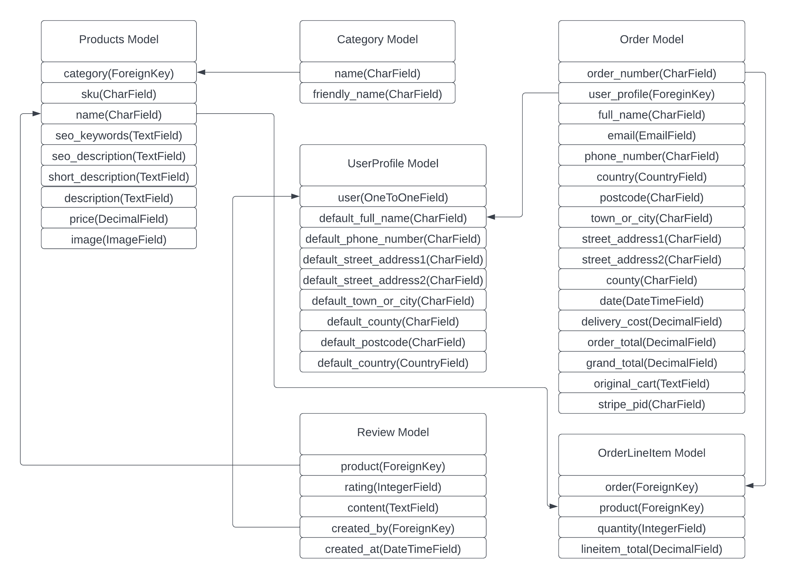

# |Aquaria Supplies

**[Live site](https://aquaria-supplies.herokuapp.com/)**

---

<span id="top"></span>

## Index

- <a href="#context">Context</a>
- <a href="#ux">UX</a>
  - <a href="#ux-iud">Ideal User Demographic</a>
  - <a href="#ux-stories">User stories / Strategy</a>
  - <a href="#ux-structure">Structure</a>
  - <a href="#ux-wireframes">Wireframes</a>
  - <a href="#ux-design">Design</a>
- <a href="#agile">Agile</a>
- <a href="#features">Features</a>
  - <a href="#features-existing">Existing Features</a>
  - <a href="#features-future">Still to implement</a>
- <a href="#technologies">Technologies Used</a>
- <a href="#testing">Testing</a>
  - <a href="#testing-stories">User Stories</a>
  - <a href="#testing-manual">Manual Testing</a>
  - <a href="#testing-automated">Automated Testing</a>
  - <a href="#testing-bugs">Known bugs</a>
- <a href="#web-marketing">Web Marketing</a>
- <a href="#deployment">Deployment</a>
- <a href="#credits">Credits</a>

---

<span id="context"></span>

# **Context**

Aquaria Supplies is an online and physical shop located in Dublin 12. They supply the most popular branded products for all fish and corals, be it freshwater or saltwater. They sell anything you would ever need and also provide help with equipment and tank setups.

<div align="right"><a style="text-align:right" href="#top">Go to index :arrow_double_up:</a></div>

<span id="ux"></span>

# **UX**

## **Ideal User Demographic**

<span id="ux-iud"></span>

The ideal users of this website are:
- Fish and Coral hobbyists
- People looking to get into coral/fish

**Strategy** was broken into three categories.
  - Roles
    - Site User
    - Site Admins
  - Demographic
    - Young to mature adults
    - Gifts givers

The website needs to enable the **Site User** to
- Find products that are required to start or upgrade their current aquariums.
- Add their desired products to cart where they can purchase them.
- Filter products throughout the site accordingly to **Users** needs.
- Search products by name, sku or description.
- Modify profile to save their default shipping details and preview past orders.

The website needs to enable the **Site Admin** to
- Add, edit and remove products on the site.
- View placed orders from admin dashboard.

<div align="right"><a style="text-align:right" href="#top">Go to index :arrow_double_up:</a></div>

<span id="ux-stories"></span>

## **User stories / Strategy**

The below MOSCOW table consists of user stories with story points and MOSCOW principles. All of the stories in the table below are what I believe I needed in order to produce a good user friendly e-commerce store. I completed all of them within timeframe. Each user story was tested and they can be found HERE.

|User Story Testing                                                     |AS   |I WANT TO BE ABLE TO…                                                 |SO THAT I CAN…                                                                                                      |Story Points|MOSCOW     |
|------------------------------------------------------------------|----------|----------------------------------------------------------------------|--------------------------------------------------------------------------------------------------------------------|------------|-----------|
|                                                                                                        1                                                                 |Shopper   |View a list of products                                               |Purchase them                                                                                             |5           |Must Have  |
|2                                                                 |Shopper   |Access products                                  |Preview them and find out more details                           |4           |Should Have |
|3                                                                 |Shopper   |Search for products                                       |Find specific product I am looking for                                |3           |Could Have  |
|4                                                                 |Shopper   |Select products categories                 |See products that interest me the most                                         |5           |Should Have |
|5                                                                 |Shopper   |View the total of all products in my cart    |I can avoid spending too much                                    |5           |Must Have |
|6                                                                 |Shopper   |Increase or decrease product quantities            |Avoid buying too many or buy more if I want to                                                  |3           |Could Have |
|7                                                                 |Shopper   |Remove products from my cart                 |I can avoid buying products I have added to my cart as an accident                                                                                            |5           |Must Have         
|8                                                                 |Shopper |See alert messages                                        |Know of any issues I am currently experiencing                                                              |4           |Could Have  |
|9                                                                 |Shopper |Use Stripe as my payment method                                                  |Safely proceed with checkout                                                                          |5           |Must Have  |
|10                                                                |Site User |Register an account                        |Preview my previous orders and edit my default shipping details                                                                                        |4           |Must Have  |
|11                                                                |Site User |Login or logout                       |Access my personal information                                                              |5           |Must Have  |
|12                                                                |Site User |Request new password in case I lose it                                        |Recover my account                                        |3           |Should Have|
|13                                                                |Site User |Edit a form             |Update my profile details                                    |2           |Should Have|
|14                                                                |Site User |Access my profile                                      |Preview my past orders                              |4           |Should Have|
|15                                                                |Site User |Receive an email after registeration                                   |Verify my account                                       |3           |Could Have|
|16                                                                |Admin  |Add products                                  |Add new products  |5           |Must Have|
|17                                                                |Admin   |Edit products                   |Update existing information |4           |Should Have|
|18                                                                |Admin   |Delete product                           |Remove products that are no longer for sale.                                                                        |4           |Should HaveHave|
|                                                                  |          |                                                                      |Total Story Points                                                                                                  |73         |           |

<div align="right"><a style="text-align:right" href="#top">Go to index :arrow_double_up:</a></div>

## **Structure**

<span id="ux-structure"></span>

### **Flowchart**
I've created a flow chart to help me visualize what navigation should feel like. It simplifies the website and lets users navigate throughout the site with ease and efficiency.


### **Database**

I have made diagram with the database scheme to guide me throughout the site progression. The diagrams below show relationships between each database models as the site was being developed. Postgresql provided by Heroku is used in production.



<div align="right"><a style="text-align:right" href="#top">Go to index :arrow_double_up:</a></div>

## **Wireframes**

<span id="ux-wireframes"></span>

The wireframes were successfully converted into a live functioning website across all devices.

The full suite of wireframes for **desktop**, **tablet** and **mobile** devices, can be accessed [here](wireframes/).

<div align="right"><a style="text-align:right" href="#top">Go to index :arrow_double_up:</a></div>

## **Design**

<span id="ux-design"></span>

### **Colour Scheme**

After looking through different e-commerce shops related to fish/corals, I concluded that the best color scheme would be a simple **plain white background with blue accents**. The below is the colours I have used the most.


### **Typography**

For fonts I decided to go with something that is simple and elegant. The fonts are as follows, Lato and Sans-serif. I think it gives site nice and clear look and ease of readability.

<div align="right"><a style="text-align:right" href="#top">Go to index :arrow_double_up:</a></div>

<span id="agile"></span>

# Agile


A link to the project with all issues can be found [here](https://github.com/users/erykslezak/projects/1)
GitHub Issues were used to list user stoires. manage and plan the implementation of all functionalities throughout the project. I started off with **Shopper** stories first followed by **users** and **admins**. Everything was distributed accordingly on stage of implementation be it **Todo**, **In Progress** or **Done**.

<span id="features"></span>

# Features

## Existing Features

<span id="features-existing"></span>

### **Every page consits of top navigation bar with consitent and responsive design.**

**Navigation Bar**

- The top navigation bar contains a site logo which brings user back to index page. A search bar to search throughout all products with auto complete popups and account management buttons such as log in, log out, register and my profile.
- There is a sticky bar containing information regarding of how much needs to be spend to get free shipping.
- There is a navigation throughout all the categories. Some categories are dropdowns and you can also sort all products by price or category.
- There is also contact details including phone number and opening hours.


**Footer**

- Footer is divided into two sections, social and newsletter.
- Social brings you directly to facebook page whereas newsletter lets you subscribe to newsletter to get notified of latest offers.


**Home Page**

- List of products sorted in order of newest being first.
- Every product preview consists of product image, category, name and price.
- If user is an admin then option for deleting/editing product is also available under each product.


**Products / Category Page**

- List of all products or sorted by categories.
- Sort by button which lets user sort all products on current page by category, name and price.
- Top of page is treated as breadcrumbs with current category chosen.
- Top left corner of page gives user product count in current selected category and a link to preview all products.
- Every product preview consists of product image, category, name and price.
- If user is an admin then option for deleting/editing product is also available under each product.


**Products Detail Page**

- Product detail page contains all information regarding the product.
- The image, name, price, sku, short description, quantity and main description are visible to the user if they were added in the backend for given product.
- Users can change quantity of the product before they add it to the cart


**Shopping Cart**

- List of all products that were added by the user.
- Abilit to update quantity in the cart as well as removing the product.
- The subtotal for each product, subtotal of the cart and then total including the delivery is given to the user.
- Buttons to either proceed to the payment page or go back to shop.


**Checkout Page**

- Form for user to input their details including delivery address and payment field for debit/credit card.
- Order summary including total quantity of products in cart.
- Each product and their current quantity and subtotal.
- The order total before and after delivery charges have been applied.
- Buttons to either complete the order or go back to the cart to adjust it.


**Checkout Success Page**

- Order information that will be sent to given email.
- Details of the order including users address, order number, date and the totals.
- Button to go back shopping.


**User Profile**

- Form for user to input and save their details such as delivery address and their name.
- Button to submit and update users details.
- Order history with order number linked to order success page as above. The date, products and the total.


**Add/Edit Products**

- Form for admin to input new product details.
- Fields for name, description and price are required. Additional fields such as short description, image or sku are optional but recommended.
- Two additional SEO fields, keywords and descriptions for admins to add per each product as desired.
- Button to either add or update existing product.
- If the form is to edit product then all fields will be prepopulated.


**Alert Messages**

- Users will get alerted by pop up messages depending on their actions.
- Message pop up are generated as either successful, warning, error and info messages.


**Deleting Products**

- If user is an admin, on each product there will be two additional link buttons for editing and deleting products.
- Once user presses delete, the product gets automatically removed from the shop.

**Account Management**

- Login, logout, registeration and all other options such as account recovery, email confirmation etc. all work via Allauth.
- Users need to confirm their accounts before accessing the store.

## **Features still to implement**

<span id="features-future"></span>

- Add more user control over their own accounts such as changing their passwords.
- Add more details to search auto complete such as product image and the price.
- From the search bar, when click on a product, bring user to the products page.
- Add product variations so each variation will have different sizes depending on bottle/bucket size.
- Add product stock so users are able to find out if the products they are purchasing are in stock.
- Slugs for each product for better SEO.

<div align="right"><a style="text-align:right" href="#top">Go to index :arrow_double_up:</a></div>

# Technologies

<span id="technologies"></span>

### **Main Languages Used**
- HTML5
- CSS
- Python
- JavaScript
- jQuery

### **Frameworks, Libraries and Programs Used**
- Django
- Heroku
- PostgreSQL
- Bootstrap
- Amazon Web Services for static and media files.
- Fontawesome
- Crispy Forms
- Pillow
- Stripe
- Psycopg2
- DJ-database-url
- Boto3
- GitHub
- GitPod

<div align="right"><a style="text-align:right" href="#top">Go to index :arrow_double_up:</a></div>

# Testing

## User Stories

<span id="testing-stories"></span>

- As a **Shopper** I want to be able to view a list of products so that I can purchase them.
  - To test this shopper story I have created products through importing data via CLI. I then accessed the website to see if all imported products will be visible.
- As a **Shopper** I want to be able to access products so that I can preview them and find out more details.
  - To test this shopper story I have opened open one of my products to see if it will bring me to the products page. I then was able to see each information that I wanted to be able to see in nice and clean way.
- As a **Shopper** I want to be able to search for products so that I can find specific product I am looking for.
  - To test this shopper story I clicked on search bar and I wrote down a product name. I was then given results as a pop up (autocomplete). I then pressed either 'Enter' or search button and all the results were displayed containing my keywords.
- As a **Shopper** I want to be able to select products categories so that I can see prodcuts that interest me the most.
  - To test this shopper story I have clicked on one of the categories in the nav bar section of the page. It then brought me to a category page with products visible for given category.
  - Some of these are categories are accessible as dropdowns so I have tested them also.
- As a **Shopper** I want to be able to view the total of all products in my cart so that I can avoid spending too much.
  - To test this shopper story I have added multiple products to my cart through adding them via products page. I then clicked on the cart button which brought me to cart page. I was given the subtotals and total of my whole cart in euros.
- As a **Shopper** I want to be able to increase or decrease product quantities so that I can avoid buying too many or buy more if I want to.
  - To test this shopper story I accessed product page where I was able to see current product quantity. By the form on each side there is either a 'minus' or 'plus' sign which either increases or decreases the product quantity.
  - I have also tested this in the cart page for each product that is currently within my cart.
- As a **Shopper** I want to be able to remove products from my cart so that I can avoid buying products I have added to my cart by an accident.
  - To test this shopper story I accessed the cart page where then I was able to see a 'delete' anchor element where if pressed, removed the product from my cart.
- As a **Shopper** I want to be able to see alert messages so that I can know of any issues I am currently experiencing.
  - To test this shopper story I added products to my cart where I was notified by a box pop up with a success message alerting me of product being added to my cart and the total.
  - I also tested this with updating/removing products, updating my profile details and using any other form throughout the site.
- As a **Shopper** I want to be able to use Stripe as my payment method so that I can safely proceed with checkout.
  - To test this shopper story I have added products to my cart where then from the cart page I proceed to the checkout page. I filled out all the details in order to test if Stripe is working correctly. The order went through and via Stripe dashboard I was able to see that everything went through successfully too.
- As a **User** I want to be able to register an account so that I can preview my previous orders and edit my details.
  - To test this user story I accessed the registeration page where I filled out all neccessary fields and submit the form. I was notified that account has been created successfully.
- As a **User** I want to be able to login or logout so that I can access my personal information.
  - To test this user story I have logged in and logged out via the main menu using freshly created account. I was brought to different page depending on the user action I was doing and notified by pop up alerts if anything has gone wrong.
- As a **User** I want to be able to request new password in case I lose it so that I can recover my account.
  - To test this user story I pressed on anchor element, 'forgot password' on login page. It brought me to page where I had to input my email I used while I was registering. I then was sent an email with recovery instructions.
- As a **User** I want to be able to edit a form so that I can update my profile details.
  - To test this user story I logged into my account and proceed to my profile page via the nav bar. I then was able to input my name and my address so that I would not have to do it again on my next orders. I have saved my details and proceed through cart to checkout page where I could see everything prepopulated.
- As a **User** I want to be able to access my profile so that I can preview my past orders.
  - To test this user story I created an order that was placed successfully. I then went to my profile page where I was able to see my previous order including details such as order number, date, products and total cost.
- As a **User** I want to be able to receive an email after registeration so that I can verify my account.
  - To test this user story I made a new account. I was then sent an email with a link to verify my account.
- As an **Admin** I want to be able to add products.
  - To test this admin story I logged in as an admin (superuser). I then hovered over nav bar where I could see a button 'Add products'. By clicking it, it brought me to a page where I could fill out all fields regarding new products including adding product image. I created a test product and it was posted successfully to the main site.
- As an **Admin** I want to be able to edit products so that I can update existing information.
  - To test this admin story I accessed product page where I could press anchor element 'Edit'. I pressed it and it brought me to an edit page with all fields prepopulated ready for editing.
  - I have also tested it via the main products view list throughout the site by either accessing categories or having all pages listed on index/products page.
- As an **Admin** I want to be able to delete products so that I can remove products that are no longer for sale.
  - To test this admin story I accessed product page where I could press anchor element 'Delete'. I pressed it on a dummy product which then got removed successfully and I got prompted by an alert message.
  - I have also tested this via the index/products page.

<div align="right"><a style="text-align:right" href="#top">Go to index :arrow_double_up:</a></div>

## Testing Manual

<span id="testing-manual"></span>

- Navigation works on every page.
- All pages are responsive for all large, medium and small screens.
- Once you log in, the nav bar changes from log in and sign up button to a button with log out and edit account options. If you an admin then you also get option for adding products.
- All products contain edit/delete anchors through all products pages if the user is an admin.
- All buttons on the website are clickable and bring you to correct pages.
- If the user is not logged in certain things become not visible and pages not accessible.
- Sort by button works for each option.
- Facebook link brings user to facebook page and newsletter gets user signed up successfully.

## Testing Automated

<span id="testing-automated"></span>

### Code Validation

- The W3C Validator was used to validate **html** and **css** code. The PEP8 Python Validator was used for **python** code. The following files were tested successfully.

<details>
<summary>HTML Pages - HTML W3C Validation</summary>

**Index**


**Products**


**Products Details**


**Cart**


**Checkout**


**Checkout Success**


**Userprofile**


**Add Product**


**Edit Product**


</details>
<br>
<details>
<summary>CSS Stylesheets - CSS W3C Validation</summary>

**Base CSS**


**Checkout CSS**


**Profile CSS**


</details>
<br>
<details>
<summary>JavaScript - JSHint Validation</summary>

**Countryfield JS**


**Stripe Element JS**


</details>
<br>

#### **Python PEP8**
- Cart
    <details>
    <summary>Cart App - PEP8 Validation</summary>

    **Contexts**

    

    **URLs**

    

    **Views**

    
    </details>
    <br>
- Checkout
    <details>
    <summary>Checkout App - PEP8 Validation</summary>

    **Admin**

    

    **APPs**

    

    **Forms**

    

    **Models**

    

    **Signals**

    

    **URLs**

    

    **Views**

    

    **Webhook Handler**

    

    **Webhooks**

    
    </details>
    <br>
- Home
    <details>
    <summary>Home App - PEP8 Validation</summary>

    **URLs**

    

    **Views**

    
    </details>
    <br>
- Products
    <details>
    <summary>Products App - PEP8 Validation</summary>

    **Admin**

    

    **Forms**

    

    **Models**

    

    **URLs**

    

    **Views**

    

    **Widgets**

    
    </details>
    <br>
- Userprofile
    <details>
    <summary>Userprofile App - PEP8 Validation</summary>

    **Forms**

    

    **Models**

    

    **URLs**

    

    **Views**

    
    </details>
    <br>
- Aquaria Supplies
    <details>
    <summary>Aquaria Supplies - PEP8 Validation</summary>

    **URLs**

    

    **Views**

    
    </details>
    <br>
- Other
    <details>
    <summary>Other .PY Files - PEP8 Validation</summary>

    **Custom Storages**

    
    </details>

<div align="right"><a style="text-align:right" href="#top">Go to index :arrow_double_up:</a></div>

<span id="testing-bugs"></span>

## **Known bugs**

Search Bar
- Currently search bar works fine except when you are on a product page. When you are on product page then results do not pop up. Searching by pressing the button or enter still works but autocomplete does not.

<div align="right"><a style="text-align:right" href="#top">Go to index :arrow_double_up:</a></div>

<span id="web-marketing"></span>

# Web Marketing

## **SEO**

The site has a **sitemap.xml** generated and **robots.txt** available in ROOT folder of project.

The meta keywords and descriptions have been updated for SEO purposes. Each product has unique keywords and descriptions related to the product. The rest of site has description and keywords related to the purpose of the e-commerce store.
All keywords and descriptions were planned out and written by me accordingly to each product.

### **Newsletter**

The footer has been equipped with a form for **Mailchimp** newsletter submissions. It allows users to subscribe to get latest deals and newest arrivals to shop.

### **Facebook**

As of now, social media marketing in the form of Facebook or Instagram is the way to reach out to the comunity. It is the best consistent way to gain new followers and customers. For this project I have created a Facebook page.
A direct link to our facebook page has been provided in footer which lets users to follow us on the platform and discuss what they would like to see in store.


<span id="deployment"></span>

# Deployment

- The project has been developed using GitPod. The code has been committed along and pushed to GitHub.

## Deploying on Heroku
To deploy this project to Heroku from it's GitHub repository, the following steps were taken.

- Create the Heroku App
  - Before creating the app please make sure the project has following files.
    - **requirements.txt** - to create this file, copy and paste the following within the terminal **'pip3 freeze --local >requirements.txt'**.
    - Procfile also needs to be created and that is done by the following command, **'python run.py > Procfile'**.
      - Add inside **web: gunicorn PROJ_NAME.wsgi**
  - Press **Create new app** button.
  - Search for **"Postgres"** within the Resources tab and select the **Heroku Postgres** option.
- Heroku Config Vars
  - Create a new key and value inside **Config Vars** on Herokus page. The key being called **SECRET_KEY** with your chosen value.
- Create and update the **settings.py** file.
  - Update ALLOWED_HOSTS with ['app_name.heroku.com','localhost']
  - Migrate your project by using the following command in CLI, **python3 manage.py migrate**
- Deploy to Heroku
  - Go to **Deploy** in the menu bar.
  - In section Deployment method select GitHub.
  - Press on **Connect to GitHub**
    - Search for your project repo.
    - Connect to your project repo.
  - In Automatic Deploys section click **Enble automatic deploys**.
  - Click Deploy Branch
  - Wait a minute or two and you should see message that app was successfully deployed.

## Forking the GitHub Repository
By forking the GitHub Repository you will be able to clone it to your own GitHub account allowing you to modify it and make any changes without affecting the main repository. Follow the steps below.

- While you are logged in GitHub look for desired repository such as this one.
- At the top of the repository (top right corner) you should be able to see **Fork** button.
- By pressing it, you should get a clone of the original repository.

## Making a Local Clone

- While you are logged in GitHub look for desired repository such as this one.
- Under main menu you should be able to see **Code** dropdown button. Click on it.
- To clone the repository using HTTPS, under HTTPS copy the link.
- Open CLI on your computer.
- Change the directory to where you want the repository to be located.
- Type **git clone** and then paste URL copied from steps above.
- Press Enter and your local clone will be created.

<div align="right"><a style="text-align:right" href="#top">Go to index :arrow_double_up:</a></div>

## Getting Stripe keys

- Register for free on Stripe and once you are verified and logged in press on **developers tab**.
- From here you should be able to find your **Secret Key** and **Public Key**.
- For last needed key go to **Webhooks** and add your own new Endpoint.
- As URL, paste in either you local or deployed URL.
- Add all events and then click on **Add Endpoint** at bottom of the page. You should now be redirected to endpoints page.
- On top now you should be able to reveal your **WH Secret Key**.
- The 3 keys should now be pasted as variables in heroku.

## Getting Email setup

- To setup emails you need to create new or use existing Gmail account.
- Once you log into head into Settings from your gmail view and press **See all settings**.
- On top now head into Accounts and imports. Scroll down and look for **Other google account settings**.
- Go into Security, enable two factor authentication and follow instructions.
- Once completed go back to security, click on **App passwords**, select Mail - Device - Django and copy your new password.
- This password will go into Heroku as variable **EMAIL_HOST_PASS** and your actual email as **EMAIL_HOST_USER**.

## Setting up AWS

- Creating Bucket
    - Go to **Amazon Web Services** page and register or login.
    - Once you are fully logged and in console page, in search on top look for **S3**, click on it.
    - Press on the bright orange button **Create Bucket** on right hand side.
    - Put in your desired bucket name (preferably your heroku app name) and select region closet to you.
    - Enabled ACLs in Object Ownership section and uncheck **Block all public access** in section below.
    - Acknowledge current settings and on bottom of the page press on **Create bucket**.
- Modifying your bucket
    - Access your newly created bucket by clicking on it.
    - On top you should now be able to see **Properties** tab, click on it.
    - Scroll all the way down to **Static website hosting**. Once you find it click Edit on the side.
    - Enable it and in **Index document**, put in 'index.html' and in **Error document** put in 'error.html'. Apply changes.
    - Now access **Permissions** tab and scroll down till you see **Cross-origin resource sharing (CORS)**. Press edit.
    - Copy the following code and paste it in and save it.
    ```
    [
    {
        "AllowedHeaders": [
            "Authorization"
        ],
        "AllowedMethods": [
            "GET"
        ],
        "AllowedOrigins": [
            "*"
        ],
        "ExposeHeaders": []
    }
    ]
    ```
    - Now scroll back up to **Bucket policy**, press edit, copy your **ARN** and click on **AWS Policy Generator**.
    - In Step 1, select your Policy as **S3 Bucket Policy**.
    - In Step 2, in Principal field put in * (star). In actions select **GetObject**, paste in your ARN and click **Add Statement**.
    - In Step 3, click on Generate Policy and copy the code you are given.
    - Go back to your **Bucket policy**, paste in the code.
    - In the code find **"Resource"** where you shoud see your ARN. At the end of your ARN add the following: /*
    - Click on save changes.
    - Go back to **Permissions** menu and press edit by **Access control list (ACL)**.
    - Under Everyone **(public access)**, tick List and save it.
- Identity and Access Management (IAM)
    - User Group
        - Head back to main console and search for IAM, access it.
        - On left hand side, click on User groups and create group.
        - Call your group **manage-your-app-name** and on bottom click Create group.
    - Policy
        - On left hand side, click on Policies and **Create policy**.
        - In top right corner click **Import managed policy**. Search for "AmazonS3FullAccess", tick the box and press Import.
        - Once imported head to **JSON** tab and paste in your **ARN** where "Resource" is as before.
        - In the Resource section, create a list containing two elements, "[ "arn::..", ""arn::../*]" First element is for bucket itself, second element is for all files and folders in the bucket.
        - Click on Next Tags, Next Review and add your policy name and description. Once you are happy click **Create policy**.
    - Attaching Policy
        - Head back to your newly created group. Open **Permissions* tab on top. Click on Add permissions and attach policy.
        - Find your policy, tick the box and on the bottom of page click on **Add permissions**.
    - Create User
        - On left hand side click on **Users** and press Add users.
        - As username call it, "your-app-name-staticfiles-user". Check the **Access key** option and press the **Next: Permissions** button.
        - Tick the group you have created earlier and press **Next: Tags**, **Next: Review** and **Create User**.
        - Download the .csv file.
- Connecting Django to AWS.
    - In CLI install the following, **boto3** and **django-storages**. Freeze requirements if it hasn't been done before.
    - Add storages to installed apps in your settings.py and then paste the code below.
    ```
    if 'USE_AWS' in os.environ:
    # Bucket Config
    AWS_STORAGE_BUCKET_NAME = 'BUCKET NAME'
    AWS_S3_REGION_NAME = 'YOUR CHOSEN REGION'
    AWS_ACCESS_KEY_ID = os.environ.get('AWS_ACCESS_KEY_ID')
    AWS_SECRET_ACCESS_KEY = os.environ.get('AWS_SECRET_ACCESS_KEY')
    AWS_S3_CUSTOM_DOMAIN = f'{AWS_STORAGE_BUCKET_NAME}.s3.amazonaws.com'

    # Cache control
    AWS_S3_OBJECT_PARAMETERS = {
        'Expires': 'Thu, 31 Dec 2099 20:00:00 GMT',
        'CacheControl': 'max-age=94608000',
    }
    ```
    - Head back to Heroku to set up enviromental variables.
    - Open the CSV file you have downloaded before as it contains keys that will need to be put into Heroku.
    - Copy the **Access Key ID**, **Secret Access Key** and add them as variables in Heroku.
    - Also create a variable, **USE_AWS** with value of True and remove **DISABLE_COLLECTSTATIC** if it hasn't been done before.
    - Create new python file in root directory called **custom_storages.py**. In that file paste the following code.
    ```
    from django.conf import settings
    from storages.backends.s3boto3 import S3Boto3Storage


    class StaticStorage(S3Boto3Storage):
        location = settings.STATICFILES_LOCATION


    class MediaStorage(S3Boto3Storage):
        location = settings.MEDIAFILES_LOCATION

    ```
    - Go back to your settings.py and paste the following code under AWS settings.
    ```
    # Static and media files
    STATICFILES_STORAGE = 'custom_storages.StaticStorage'
    STATICFILES_LOCATION = 'static'
    DEFAULT_FILE_STORAGE = 'custom_storages.MediaStorage'
    MEDIAFILES_LOCATION = 'media'

    # Override static and media URLs in production
    STATIC_URL = f'https://{AWS_S3_CUSTOM_DOMAIN}/{STATICFILES_LOCATION}/'
    MEDIA_URL = f'https://{AWS_S3_CUSTOM_DOMAIN}/{MEDIAFILES_LOCATION}/'
    ```
    - Head back to your S3 bucket. Create new folder called **media**.
    - Within the folder click Upload and select all of your media files.

<div align="right"><a style="text-align:right" href="#top">Go to index :arrow_double_up:</a></div>

<span id="credits"></span>

# Credits

- The project was based on the example of Boutique Ado from Code Institute. With much more ahead of me to bring it to fully functional store with many more features, long road ahead of me.

- [Stack Overflow](https://stackoverflow.com/) - Many issues I have googled brought me there with explanations and solutions.
- [W3 Schools](https://www.w3schools.com/) - Best resource when it comes to attributes etc. Used it many times and without it I would be more confused.
- [Bootstrap Documentation](https://getbootstrap.com/docs/5.2/getting-started/introduction/) - Helped me so much with all different classes etc.
- [Google](https://www.google.com/)