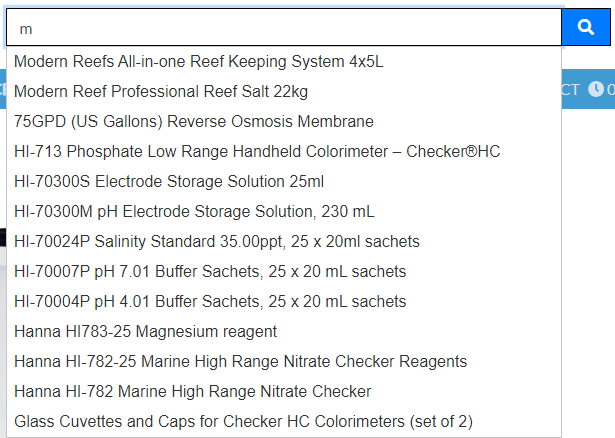

# |Aquaria Supplies

**[Live site](https://aquaria-supplies.herokuapp.com/)**

---

## Index

- <a href="#context">Context</a>
- <a href="#ux">UX</a>
  - <a href="#ux-iud">Ideal User Demographic</a>
  - <a href="#ux-stories">User stories / Strategy</a>
  - <a href="#ux-structure">Structure</a>
  - <a href="#ux-wireframes">Wireframes</a>
  - <a href="#ux-design">Design</a>
- <a href="#features">Features</a>
  - <a href="#features-existing">Existing Features</a>
  - <a href="#features-future">Still to implement</a>
- <a href="#technologies">Technologies Used</a>
- <a href="#testing">Testing</a>
  - <a href="#testing-stories">User Stories</a>
  - <a href="#testing-manual">Manual Testing</a>
  - <a href="#testing-automated">Automated Testing</a>
  - <a href="#testing-bugs">Known bugs</a>
- <a href="#deployment">Deployment</a>
- <a href="#credits">Credits</a>

---

# **Context**

Aquaria Supplies is an online and physical shop located in Dublin 12. They supply the most popular branded products for all fish and corals, be it freshwater or saltwater. They sell anything you would ever need and also provide help with equipment and tank setups.

<a style="text-align:right" href="#top">Go to index :arrow_double_up:</a>

# **UX**

## **Ideal User Demographic**

The ideal users of this website are:
- Fish and Coral hobbyists
- People looking to get into coral/fish

**Strategy** was broken into three categories.
  - Roles
    - Site User
    - Site Admins
  - Demographic
    - Young to mature adults
    - Gifts givers

The website needs to enable the **Site User** to
- Find products that are required to start or upgrade their current aquariums.
- Add their desired products to cart where they can purchase them.
- Filter products throughout the site accordingly to **Users** needs.
- Search products by name, sku or description.
- Modify profile to save their default shipping details and preview past orders.

The website needs to enable the **Site Admin** to
- Add, edit and remove products on the site.
- View placed orders from admin dashboard.

<a style="text-align:right" href="#top">Go to index :arrow_double_up:</a>

## **User stories / Strategy**

The below MOSCOW table consists of user stories with story points and MOSCOW principles. All of the stories in the table below are what I believe I needed in order to produce a good user friendly e-commerce store. I completed all of them within timeframe. Each user story was tested and they can be found HERE.

|User Story Testing                                                     |AS   |I WANT TO BE ABLE TO…                                                 |SO THAT I CAN…                                                                                                      |Story Points|MOSCOW     |
|------------------------------------------------------------------|----------|----------------------------------------------------------------------|--------------------------------------------------------------------------------------------------------------------|------------|-----------|
|                                                                                                        1                                                                 |Shopper   |View a list of products                                               |Purchase them                                                                                             |5           |Must Have  |
|2                                                                 |Shopper   |Access products                                  |Preview them and find out more details                           |4           |Should Have |
|3                                                                 |Shopper   |Search for products                                       |Find specific product I am looking for                                |3           |Could Have  |
|4                                                                 |Shopper   |Select products categories                 |See products that interest me the most                                         |5           |Should Have |
|5                                                                 |Shopper   |View the total of all products in my cart    |I can avoid spending too much                                    |5           |Must Have |
|6                                                                 |Shopper   |Increase or decrease product quantities            |Avoid buying too many or buy more if I want to                                                  |3           |Could Have |
|7                                                                 |Shopper   |Remove products from my cart                 |I can avoid buying products I have added to my cart as an accident                                                                                            |5           |Must Have         
|8                                                                 |Shopper |See alert messages                                        |Know of any issues I am currently experiencing                                                              |4           |Could Have  |
|9                                                                 |Shopper |Use Stripe as my payment method                                                  |Safely proceed with checkout                                                                          |5           |Must Have  |
|10                                                                |Site User |Register an account                        |Preview my previous orders and edit my default shipping details                                                                                        |4           |Must Have  |
|11                                                                |Site User |Login or logout                       |Access my personal information                                                              |5           |Must Have  |
|12                                                                |Site User |Request new password in case I lose it                                        |Recover my account                                        |3           |Should Have|
|13                                                                |Site User |Edit a form             |Update my profile details                                    |2           |Should Have|
|14                                                                |Site User |Access my profile                                      |Preview my past orders                              |4           |Should Have|
|15                                                                |Site User |Receive an email after registeration                                   |Verify my account                                       |3           |Could Have|
|16                                                                |Admin  |Add products                                  |Add new products  |5           |Must Have|
|17                                                                |Admin   |Edit products                   |Update existing information |4           |Should Have|
|18                                                                |Admin   |Delete product                           |Remove products that are no longer for sale.                                                                        |4           |Should HaveHave|
|                                                                  |          |                                                                      |Total Story Points                                                                                                  |73         |           |

<a style="text-align:right" href="#top">Go to index :arrow_double_up:</a>

## **Structure**

## **Wireframes**

The wireframes were successfully converted into a live functioning website across all devices.

The full suite of wireframes for **desktop**, **tablet** and **mobile** devices, can be accessed [here](wireframes/).

<a style="text-align:right" href="#top">Go to index :arrow_double_up:</a>

## **Design**

### **Colour Scheme**

After looking through different e-commerce shops related to fish/corals, I concluded that the best color scheme would be a simple **plain white background with blue accents**. The below is the colours I have used the most.

### **Typography**

For fonts I decided to go with something that is simple and elegant. The fonts are as follows, Lato and Sans-serif. I think it gives site nice and clear look and ease of readability.

<a style="text-align:right" href="#top">Go to index :arrow_double_up:</a>

# Features

## Existing Features

### **Every page consits of top navigation bar with consitent and responsive design.**

**Navigation Bar**

- The top navigation bar contains a site logo which brings user back to index page. A search bar to search throughout all products with auto complete popups and account management buttons such as log in, log out, register and my profile.
- There is a sticky bar containing information regarding of how much needs to be spend to get free shipping.
- There is a navigation throughout all the categories. Some categories are dropdowns and you can also sort all products by price or category.
- There is also contact details including phone number and opening hours.

**Footer**

- Footer is divided into two sections, social and newsletter.
- Social brings you directly to facebook page whereas newsletter lets you subscribe to newsletter to get notified of latest offers.

**Home Page**

- List of products sorted in order of newest being first.
- Every product preview consists of product image, category, name and price.
- If user is an admin then option for deleting/editing product is also available under each product.

**Products / Category Page**

- List of all products or sorted by categories.
- Sort by button which lets user sort all products on current page by category, name and price.
- Top of page is treated as breadcrumbs with current category chosen.
- Top left corner of page gives user product count in current selected category and a link to preview all products.
- Every product preview consists of product image, category, name and price.
- If user is an admin then option for deleting/editing product is also available under each product.

**Products Detail Page**

- Product detail page contains all information regarding the product.
- The image, name, price, sku, short description, quantity and main description are visible to the user if they were added in the backend for given product.
- Users can change quantity of the product before they add it to the cart

**Shopping Cart**

- List of all products that were added by the user.
- Abilit to update quantity in the cart as well as removing the product.
- The subtotal for each product, subtotal of the cart and then total including the delivery is given to the user.
- Buttons to either proceed to the payment page or go back to shop.

**Checkout Page**

- Form for user to input their details including delivery address and payment field for debit/credit card.
- Order summary including total quantity of products in cart.
- Each product and their current quantity and subtotal.
- The order total before and after delivery charges have been applied.
- Buttons to either complete the order or go back to the cart to adjust it.

**Checkout Success Page**

- Order information that will be sent to given email.
- Details of the order including users address, order number, date and the totals.
- Button to go back shopping.

**User Profile**

- Form for user to input and save their details such as delivery address and their name.
- Button to submit and update users details.
- Order history with order number linked to order success page as above. The date, products and the total.

**Add/Edit Products**

- Form for admin to input new product details.
- Fields for name, description and price are required. Additional fields such as short description, image or sku are optional but recommended.
- Two additional SEO fields, keywords and descriptions for admins to add per each product as desired.
- Button to either add or update existing product.
- If the form is to edit product then all fields will be prepopulated.

**Alert Messages**

- Users will get alerted by pop up messages depending on their actions.
- Message pop up are generated as either successful, warning, error and info messages.

**Deleting Products**

- If user is an admin, on each product there will be two additional link buttons for editing and deleting products.
- Once user presses delete, the product gets automatically removed from the shop.

**Account Management**

- Login, logout, registeration and all other options such as account recovery, email confirmation etc. all work via Allauth.
- Users need to confirm their accounts before accessing the store.

## **Features still to implement**

- Add more user control over their own accounts such as changing their passwords.
- Add more details to search auto complete such as product image and the price.
- From the search bar, when click on a product, bring user to the products page.
- Add product variations so each variation will have different sizes depending on bottle/bucket size.
- Add product stock so users are able to find out if the products they are purchasing are in stock.

<a style="text-align:right" href="#top">Go to index :arrow_double_up:</a>
